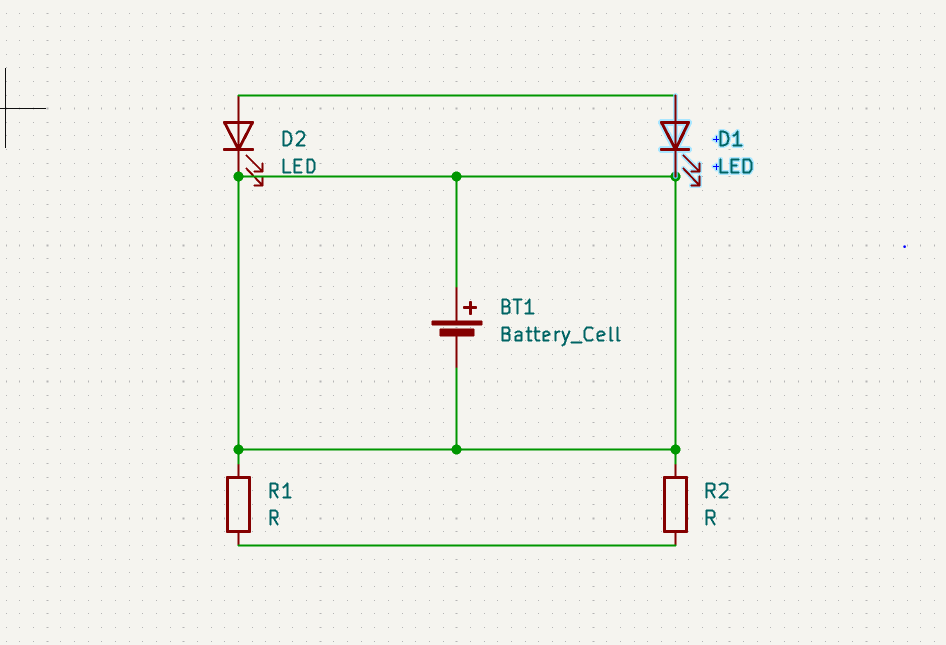
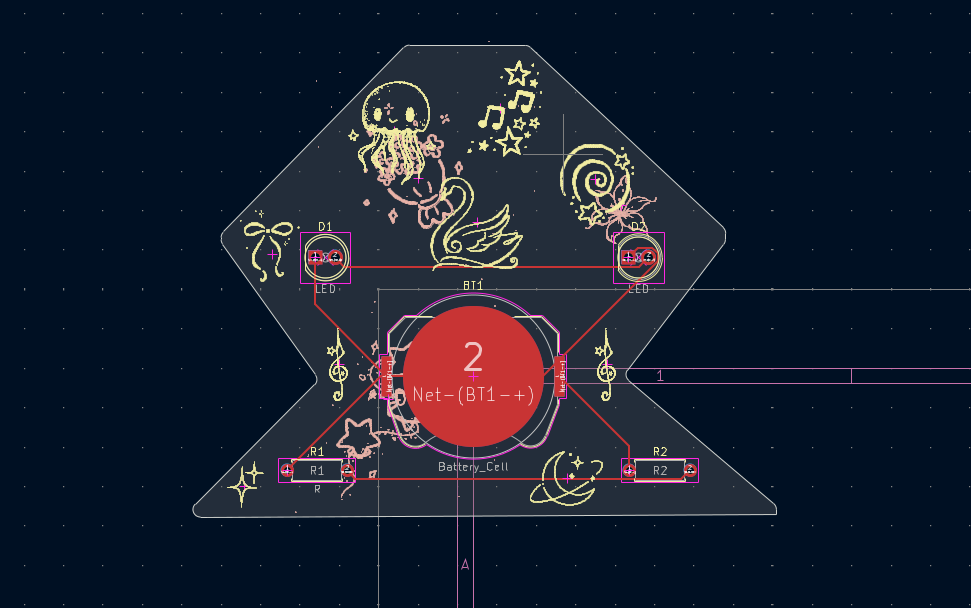
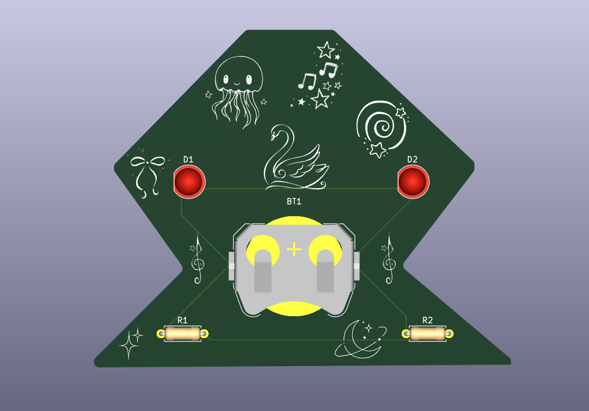

## Schematic

## PCB

## How to build
Just order the PCB & components, open up the KiCAD file and build it accordingly.

## BOM
- 2x	Battery
- 2x	Resistor
- 2x 	LED

Made by me
Made as a part of SOLDER YSWS
